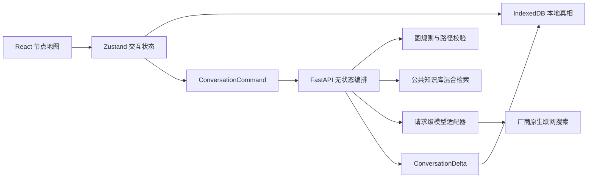

# 学习路径 Agent：产品架构与稳定契约

## 1. 已确认的产品边界

- 一个项目允许拥有多个学习目标，各目标互不干扰。
- 每次创建目标都重新填写背景、学习内容和目标程度。
- 模型、背景、目标和 Prompt 在目标创建后不可修改；填错时新建目标。
- 一个节点代表一次已经完成的一问一答，不保存半个问答节点。
- 主线默认向下；分支相对当前方向转弯。
- 根节点不允许分支，只允许一个向下普通后继。
- 非根节点最多三个子节点：一个直行和两个转弯。
- 四条物理边是硬限制，同一端口不能连接多个子节点。
- 单击节点只查看；双击才切换下一次提问的位置。
- 单纯拖动画布不改变当前位置。
- 浏览器保存全部用户数据，服务端不保存学习会话。
- 当前 MVP 无账号和跨设备同步，使用 JSON 导入导出迁移。
- 公共固定知识库和厂商联网搜索都是正式问答的核心能力。

## 2. 总体数据流

前端发送的不是全部正文树，而是：

- 完整的紧凑图结构；
- 当前来源节点的单条祖先路径；
- 当前活动摘要；
- 尚未被摘要覆盖的近期完整问答；
- 固定学习背景、目标和 Prompt 快照；
- 本次问题和资料来源模式。

后端校验通过并完成模型调用后，只返回一次原子增量。前端验证修订号后，
在一个 IndexedDB 事务中应用增量。

## 模块名称：学习会话图

### 📦 输出

- `app/learning/domain/models.py`：领域模型和图引用不变量。
- `app/learning/domain/graph_policy.py`：创建根节点、续写和分支规则。

### 🧩 解决的问题

把用户看到的节点地图变成可验证的数据结构，阻止根节点分支、重复端口、
错误方向、循环引用和跨分支污染。

### ✅ 完成的功能

- [x] 一问一答一个节点。
- [x] 主线直行、分支转弯。
- [x] 根节点与四端口硬限制。
- [x] Branch 只保存末端书签，不复制共同祖先。
- [x] SummaryVersion 追加保存，不覆盖原文。

### ⚡ 暴露的函数/接口

- `LearningConversation`
- `LearningGraphPolicy.plan(...) -> GraphPlacement`
- `LearningConversation.is_ancestor(...) -> bool`
- `LearningConversation.first_child_after(...) -> Optional[str]`

## 模块名称：无状态学习问答

### 📦 输出

- `app/learning/contracts/commands.py`：浏览器到后端的命令契约。
- `app/learning/contracts/delta.py`：后端到浏览器的增量契约。
- `app/learning/application/turn_orchestrator.py`：一次问答编排。
- `app/learning/routes.py`：HTTP 入口。

### 🧩 解决的问题

让服务端不依赖用户数据库，仍能安全验证当前图、构造上下文、调用模型并
返回可原子应用的结果。

### ✅ 完成的功能

- [x] API Key 仅随当前请求传递。
- [x] `expected_revision` 防止旧响应覆盖新状态。
- [x] `operation_id` 支持前端幂等落库。
- [x] 失败时不返回半个节点。
- [x] 只接受连续的当前祖先路径。

### ⚡ 暴露的函数/接口

- `LearningTurnOrchestrator.execute(command, api_key)`
- `POST /learning/conversations/turns`
- Header：`X-Provider-API-Key`
- 输入：`ConversationCommand`
- 输出：`ConversationDelta`

## 模块名称：上下文压缩

### 📦 输出

- `app/learning/application/path_validator.py`
- `app/learning/application/context_service.py`
- `app/learning/application/snapshot_adapter.py`

### 🧩 解决的问题

长路径超过模型上下文时，压缩已经完成的旧问答，同时保留近期原文和
学习进度，且不把兄弟分支内容混入当前请求。

### ✅ 完成的功能

- [x] Prompt、固定背景、摘要、近期问答、RAG、当前问题按稳定顺序组装。
- [x] 摘要覆盖到完整节点边界。
- [x] 保留最近三个完整问答。
- [x] 摘要记录学习规划、已完成点、当前点、用户决定和未解决问题。
- [x] 无法安全压缩时明确失败，不写坏本地状态。

### ⚡ 暴露的函数/接口

- `ActivePathValidator.validate(...)`
- `LearningContextService.prepare(...) -> PreparedLearningContext`
- `CompactGraphAdapter.to_conversation(...)`

## 模块名称：模型热插拔与联网

### 📦 输出

- `app/llm/contracts.py`：统一模型能力契约。
- `app/llm/runtime_factory.py`：按请求创建适配器。
- `app/llm/providers/`：厂商独立适配器。
- `app/llm/routes.py`：模型目录和连接测试。

### 🧩 解决的问题

上游不感知不同 SDK、搜索工具和引用格式；API Key 不进入全局可变状态。

### ✅ 完成的功能

- [x] 请求级 API Key 和模型实例。
- [x] 普通回答、自动搜索、必须搜索三种策略。
- [x] OpenAI、xAI、Anthropic、GLM 原生搜索。
- [x] DeepSeek、MiniMax 不支持搜索时显式降级或拒绝。
- [x] 正文、引用、Token 用量和警告统一返回。

### ⚡ 暴露的函数/接口

- `RuntimeLLMFactory.create(provider, model, api_key)`
- `LLMProviderAdapter.generate(request)`
- `GET /llm/presets`
- `POST /llm/connection-test`

## 模块名称：公共固定知识库

### 📦 输出

- `app/retrieval/`：清单、切片、索引、融合和查询。
- `scripts/build_knowledge_base.py`：离线构建入口。
- `knowledge_base/`：源清单与部署索引。

### 🧩 解决的问题

在不使用云数据库的前提下，把开发者预先整理的权威资料随应用部署，并
为每次学习问答提供可引用的相关片段。

### ✅ 完成的功能

- [x] Markdown/纯文本离线切片。
- [x] SQLite FTS5 关键词检索。
- [x] FAISS 向量检索。
- [x] RRF 混合排序与单索引故障降级。
- [x] 固定小型中文向量模型延迟加载。
- [x] 空知识库也可以正常部署和查询。

### ⚡ 暴露的函数/接口

- `KnowledgeBaseBuilder.build(...)`
- `KnowledgeRetriever.retrieve(query, limit)`
- `GET /knowledge-base/info`
- CLI：`python scripts/build_knowledge_base.py`

## 模块名称：浏览器本地数据

### 📦 输出

- `frontend/src/features/goals/storage/goalRepository.ts`
- `frontend/src/features/goals/storage/backup.ts`
- `frontend/src/features/chat/application/commandBuilder.ts`

### 🧩 解决的问题

不用云数据库也能支持多个学习目标、完整分支历史和换设备手动迁移。

### ✅ 完成的功能

- [x] IndexedDB 保存规范化会话图。
- [x] 一个事务应用一次完整 Delta。
- [x] 本地修订号冲突检查。
- [x] `operation_id` 幂等重放。
- [x] JSON 导入导出。
- [x] 导入时拒绝包含 API Key 字段的备份。

### ⚡ 暴露的函数/接口

- `GoalRepository.list/get/save/applyDelta`
- `serializeBackup(goals)`
- `parseBackup(raw)`
- `buildConversationCommand(input)`

## 3. 部署可行性结论

当前架构可以低成本云部署：

- 前端是静态文件；
- 后端无用户数据库和会话粘性；
- 公共知识库是只读文件；
- API Key 由用户每次在浏览器输入；
- 多个后端实例都可独立处理同一命令。

需要接受的限制：

- 清理浏览器数据会丢失未导出的记录；
- 换设备必须手动导入；
- 无法在服务端实现全局幂等，只能由本地修订号和操作 ID 保证当前浏览器
  不重复应用响应；
- 公共知识库更新需要重新构建索引并发布后端。

用户量增加后，可以在不改变问答契约的情况下，把
`GoalRepository` 换成云同步仓库。上层状态和后端命令不需要重写。
